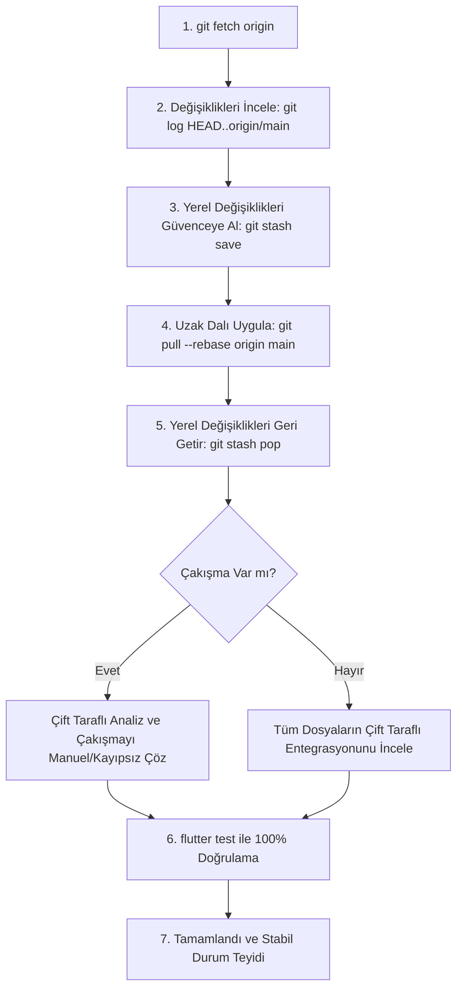

# Kayıpsız Git Senkronizasyon ve Akıllı Birleştirme Protokolü

Bu kural, projede uzaktan (`origin/main`) kod çekilirken (pull / rebase / fetch) yerel geliştirmelerin ve uzak özelliklerin hiçbir kayıp olmadan, çakışma kaynaklı hata üretmeden birleştirilmesini ve testlerle güvenceye alınmasını zorunlu kılar.

---

## 1. Altın İlkeler (Kayıpsız Entegrasyon)
1. **Kör Ezme ve Gizli Üzerine Yazma Yasağı:** `git pull`, `git merge` veya `git checkout` yaparken yereldeki değişiklikler, staged edilmiş kodlar veya scriptler asla doğrudan ezilemez/silinemez.
2. **Çift Yönlü Özellik Analizi (Bidirectional Diff Analysis):** Birleştirme yapılmadan önce hem uzaktaki yeni commit'ler (`git log HEAD..origin/main -p`) hem de yereldeki değişiklikler (`git diff`) analiz edilir. Her iki tarafın getirdiği tüm özelliklerin nihai kodda yer alması sağlanır.
3. **Kapsayıcı Birleştirme (Inclusive Integration):** Çakışma veya üst üste binen dosyalarda (örn. render bileşenleri, UI widget'ları, ekonomi servisleri) bir tarafın kodu diğerini saf dışı bırakamaz; iki mantık da sistem mimarisine uygun şekilde entegre edilir.
4. **Zorunlu Test Doğrulaması:** Her birleştirme işleminden hemen sonra `flutter test` çalıştırılarak tüm testlerin eksiksiz geçtiği (yeşil) doğrulanmalıdır.

---

## 2. Adım Adım Güvenli Pull ve Birleştirme İş Akışı

### Detaylı İşlem Adımları:
1. **Keşif ve Ön Analiz:**
   * `git fetch origin` ile uzak durum çekilir.
   * `git log HEAD..origin/main --oneline` ve `git diff HEAD origin/main --stat` ile gelen commit'ler ve etkilenen dosyalar listelenir.
2. **Yerel Durumu Koruma:**
   * `git status` ile yerel ve izlenmeyen değişiklikler tespit edilir.
   * `git stash save "local_pre_sync"` ile yerel çalışma güvenceye alınır.
3. **Senkronizasyon (Rebase):**
   * `git pull --rebase origin main` çalıştırılır.
4. **Akıllı Entegrasyon (Pop & Merge):**
   * `git stash pop` ile yerel kodlar geri getirilir.
   * Çakışma durumunda çakışan her iki blok (HEAD ve Incoming) dikkatle okunur; yerel mantık (örn. özel mülkiyet sınırları, yerel scriptler) ile uzak mantık (örn. tema, yeni mekanikler) birbiriyle harmanlanır.
5. **Doğrulama ve İzolasyon:**
   * `flutter test` çalıştırılır. Testlerden herhangi biri başarısız olursa regresyon analiz edilip derhal düzeltilir.
